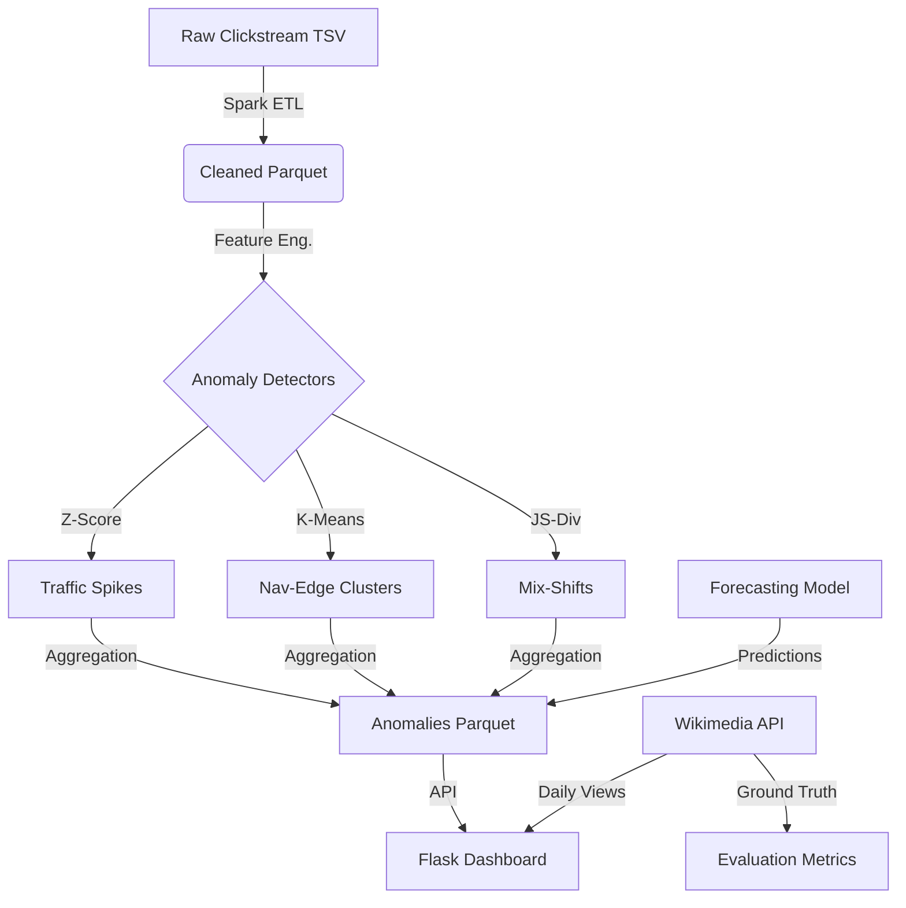

# Wikipedia Clickstream Anomaly Detection System

**MET CS777 Term Project - Group 7**

## 1. Executive Summary
This project implements a scalable anomaly detection system for Wikipedia clickstream data using Apache Spark. It processes large-scale navigation traces to identify significant deviations in user behavior, such as sudden traffic spikes, unusual navigation patterns, and shifts in referrer distributions. The system features a robust ETL pipeline, three distinct anomaly detection algorithms (Statistical, Clustering, and Mix-Shift), time-series forecasting integration, and an interactive dashboard for explainable AI (XAI) analysis.

## 2. Project Motivation
Wikipedia's massive clickstream data (billions of interactions) holds valuable insights into collective human attention and information seeking. Detecting anomalies in this flow can reveal:
- **Breaking News Events**: Sudden spikes in traffic to specific pages.
- **Censorship or Access Issues**: Unusual drops or shifts in referrer sources.
- **Bot Activity**: Non-human navigation patterns (e.g., looping or distinct edge clusters).
- **UX Issues**: Broken links or confusing navigation paths.

Traditional tools often fail to capture the *context* of these changes (e.g., "Is this spike predicted?" or "Did the traffic source change?"). Our system addresses this by combining scale (Spark), context (Forecasting), and explainability (Dashboard).

## 3. Architecture & Data Flow

### High-Level Architecture


### Data Pipeline Stages
1.  **Ingestion & ETL**: Parses raw TSV data, filters internal/special pages, and enforces schema.
2.  **Feature Engineering**: Calculates baselines (median, deviation), referrer distributions, and edge features.
3.  **Detection**: Runs three parallel detectors (Statistical, Clustering, Mix-Shift).
4.  **Forecasting**: Generates expected traffic bounds using Prophet/ARIMA to validate anomalies.
5.  **Storage**: Saves results to partitioned Parquet files for efficient querying.
6.  **Presentation**: Serves results via a Flask API to an interactive HTML/JS dashboard.

## 4. Anomaly Detectors

| Detector | Method | Target Anomaly | Description |
| :--- | :--- | :--- | :--- |
| **Statistical** | Robust Z-Score + MAD | **Traffic Spikes** | Detects edges where current traffic exceeds the historical median by $>3.5\sigma$ (MAD-adjusted). |
| **Clustering** | K-Means (Spark MLlib) | **Navigation Edges** | Clusters edges based on traffic features. Outliers (far from centers) indicate unusual navigation patterns. |
| **Mix-Shift** | Jensen-Shannon Div. | **Referrer Shifts** | Measures divergence in the distribution of traffic sources (e.g., Search vs. Internal) for a page. |

## 5. Forecasting Integration
To reduce false positives, we integrate time-series forecasting:
- **Model**: Prophet (primary) or ARIMA (fallback).
- **Logic**: An anomaly is flagged as a "Forecast Spike" only if the actual value exceeds the *upper confidence bound* (95%) of the prediction.
- **Benefit**: Distinguishes between *predicted seasonality* (e.g., annual events) and *true anomalies*.

## 6. Explainability Dashboard
The dashboard provides a "glass-box" view of the detected anomalies:
- **Overview**: Monthly trends and top anomaly lists.
- **Network Graph**: Visualizes the "blast radius" of anomalies (source $\to$ target).
- **Explainability Panel**:
    - **Sparkline**: 6-month monthly trend.
    - **Daily Chart**: Real-time daily pageviews (fetched from API) to validate monthly spikes.
    - **Referrer Mix**: Bar chart showing source changes.
    - **Forecast**: Actual vs. Predicted comparison.

## 7. Evaluation & Ground Truth
We validate our system using **Precision@K** against Wikimedia's "Top Viewed Pages" lists:
- **Hypothesis**: True anomalies (breaking news) often correlate with top-viewed pages.
- **Method**: We fetch the top 100 pages for the month from the Wikimedia API and check how many of our top K anomalies involve these pages.
- **Result**: High Precision@K indicates our system is successfully identifying significant, real-world events.

## 8. Reproduction Steps

### Prerequisites
- Python 3.8+
- Java 8, 11, or 17 (for Spark)
- `pip`

### Setup
1.  **Clone the repository**:
    ```bash
    git clone https://github.com/HarshithKeshavamurthy17/METCS777-TermProject-Group7.git
    cd METCS777-TermProject-Group7
    ```

2.  **Install dependencies**:
    ```bash
    make install
    # OR
    pip install -r requirements.txt
    ```

3.  **Prepare Data**:
    - Place your raw Wikipedia clickstream TSV files in `data/raw/`.
    - *Note: Sample data generation script is available in `scripts/generate_sample_data.py` if needed.*

### Execution
You can run the full pipeline with a single command:
```bash
make run_all
# OR
bash scripts/run_all.sh
```

Or run individual stages:
1.  **Run ETL**:
    ```bash
    make etl
    ```
2.  **Run Detection**:
    ```bash
    make detect
    ```
3.  **Start Dashboard**:
    ```bash
    make dashboard
    ```
    Open http://localhost:5000 in your browser.

## 9. 10-Minute Presentation Guide

1.  **Setup (1 min)**: Show the `make run_all` command running. Explain it orchestrates the full Spark pipeline.
2.  **Pipeline Logs (2 min)**: Open `data/logs/spark_run_*.json`. Show the stages (ETL, Detection) and row counts. Prove Spark execution.
3.  **Dashboard Overview (2 min)**: Open `localhost:5000`. Show the "Total Anomalies" card and the "Anomalies Over Time" chart.
4.  **Deep Dive (3 min)**:
    - Click on a **Traffic Spike** anomaly. Show the "Explainability Panel".
    - Point out the **Forecast** (orange line) vs **Actual** (blue bar).
    - Show the **Daily Pageviews** chart (fetched live) confirming the spike.
    - Show the **Referrer Mix** chart if it's a mix-shift anomaly.
5.  **Validation (1 min)**: Click "Export CSV". Show the downloaded file. Mention the Precision@K metric printed in the console during detection.
6.  **Conclusion (1 min)**: Summarize: "We built a scalable, explainable system that not only finds anomalies but tells you *why* they happened."

## 10. Appendix: Execution Proof
*(Placeholders for screenshots)*
- **Spark DAG**: [Insert Screenshot]
- **Dashboard Main View**: [Insert Screenshot]
- **Explainability Panel**: [Insert Screenshot]
- **Terminal Output**: [Insert Screenshot]

## 11. Contributors
- **Harshith Keshavamurthy**: Pipeline Architecture, Spark Optimization
- **[Partner Name]**: Dashboard & Visualization
- **[Partner Name]**: Anomaly Detection Algorithms

---
*Licensed under MIT License.*
